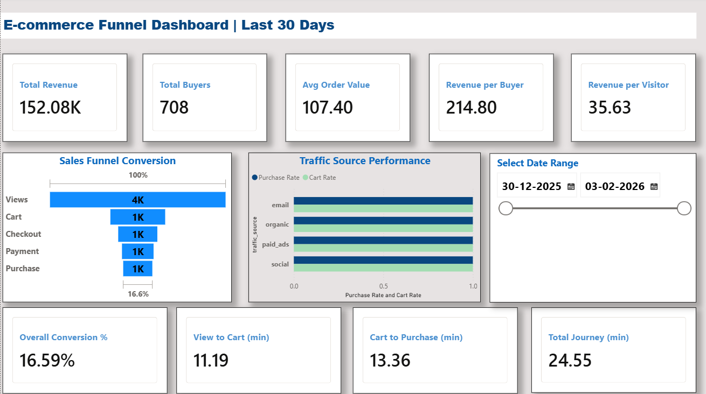

# 🛒 E-Commerce Sales Funnel Analysis
SQL-based e-commerce funnel analysis to identify drop-offs ,sourceperformance,conversion timing and revenue opportunities -Built using MySQL views on raw event level data.

------------------------------------------------------------------------------------------------------------------
# 🖼️ Dashboard Preview 




## Power BI Dashboard

### 📊 Download the dashboard: [`sales_funnel_dashboard.pbix`](./powerbi/sales_funnel_dashboard.pbix)

# 📁 Project Stucture
```text
├── assets/
│   └── Dashboard_preview.png      # Dashboard screenshot
├── data/
│   └── user_events.csv           # Raw event-level dataset
├── sql/
│   └── sql_create_views.sql      # SQL views used for analysis
├── PowerBI/
│   └── dashboard.pbix            # Power BI dashboard file
└── README.md
```

# 🔍 About the Dataset
The Dataset (**`user_events.csv`**) conatins user-level e-commerce event logs with fields `user_id`,`event_type`,`event_date`,`traffic_source` and `amount`.Events tracked:`page_view` ,`add_to_cart`,`checkout_start`,`payment_info` and `purchase`.

# 🚪SQL Views
The analysis is powered by 4 SQL views.View the full SQL here:[`sql_create_views.sql`](./sql_create_views.sql)
| View |Description|
|------|-----------|
|`vw_funnel_conversion`|Stage-by-stage funnel with conversion rates|
|`vw-source_performance`|Funnel breakdown by traffic source|
|`vw_conversion_time`|Average time between funnel stages|
|`vw_revenue summary`|Revenue KPIs including AOV and revenue per visitor|

# 📈 Analysis

## 1.Sales Funnel Stages:

| Stage | Funnel_Step | Users |
|-------|-------------|-------|
| 1 | View | 4268 |
| 2 | Cart | 1332 |
| 3 | Checkout | 951 |
| 4 | Payment | 768 |
| 5 | Purchase | 708 |


The funnel shows how users progress through each purchase stage. As users move forward, the count decreases, indicating drop-off at each stage.
### 💡Key Insight:
Largest drop_off occurs between View and cart stage.

## 2.Conversion Rates Through the Funnel:
| Funnel Transition  |       Users | Conversion Rate | Insight                                                                  |
| ------------------ | ----------: | --------------: | ------------------------------------------------------------------------ |
| View → Cart        | 4268 → 1332 |             31% | Lowest conversion stage; many users view products but do not add to cart |
| Cart → Checkout    |  1332 → 951 |             71% | Good progression after cart addition                                     |
| Checkout → Payment |   951 → 768 |             81% | Most users continue once checkout starts                                 |
| Payment → Purchase |   768 → 708 |             92% | Highest conversion stage; very low drop-off                              |
| Overall Funnel     |  4268 → 708 |             17% | Final purchase conversion from total views                               |

### 💡Key Insight:
View → Cart has the lowest conversion rate, further analysis is needed to identify whether users are dropping due to product mismatch, missing information, or poor add-to-cart visibility.

## 3.Funnel by Traffic Source:
| Source   | Views | Carts | Purchases | View → Cart | View → Purchase | Cart → Purchase | Insight                                   |
| -------- | ----: | ----: | --------: | ----------: | --------------: | --------------: | ----------------------------------------- |
| Organic  |  1750 |   576 |       300 |         33% |             17% |             52% | Stable performance, moderate conversion   |
| Paid Ads |   820 |   305 |       173 |         37% |             21% |             57% | Best performing paid source               |
| Email    |   445 |   280 |       151 |         63% |             34% |             54% | Highest quality traffic                   |
| Social   |  1253 |   171 |        84 |         14% |              7% |             49% | Weakest source, major drop at first stage |

### 💡Key Insight:
Social media generates high traffic (1253 views) but shows the lowest conversion efficiency, with only -14% of users reach cart and 7% complete purchases.
Email generates fewer visits (445 views) but delivers the highest purchase conversion (34%), indicating stronger user intent and better targeting.

## 4.Time to Conversion Analysis:
| Metric | Value |
|---|---:|
| Converted Users | 708 |
| Average View → Cart Time | 11.19 minutes |
| Average Cart → Purchase Time | 13.36 minutes |
| Average Total Journey Time | 24.55 minutes |

### 💡Key Insight:
The average 24.55-minute journey indicates moderate decision time before final purchase, with checkout contributing slightly more delay than initial product selection.

## 5.Revenue Funnel Analysis:
| Metric              |    Value |
| ------------------- | -------: |
| Total Visitors      |     4268 |
| Total Buyers        |      708 |
| Total Orders        |      708 |
| Total Revenue       | 76037.93 |
| Average Order Value |   107.40 |
| Revenue per Buyer   |   107.40 |
| Revenue per Visitor |    17.82 |

### 💡Key Insight:
Out of 4268 visitors, 708 completed purchases, generating total revenue of $76037.93, with an average order value of $107.40 per buyer.

# 🔧 Final Recommendations
## 1. 📉 Optimize Social Media for Quality, Not Just Volume
Social media contributes a large share of traffic but shows the lowest conversion efficiency, indicating weak purchase intent.
#### Action: 
 Shift campaigns toward retargeting, lead capture, and email list acquisition rather than raw traffic volume.

## 2. 📜 Scale High-Performing Email Marketing
Email delivers the highest conversion efficiency despite lower traffic volume.
#### Action: 
Expand retention campaigns, personalized offers, and remarketing efforts to grow this channel.

## 🛠️ Tools Used:
#### 1.Excel
#### 2.MySQL
#### 3.Power Query
#### 4.Power BI
